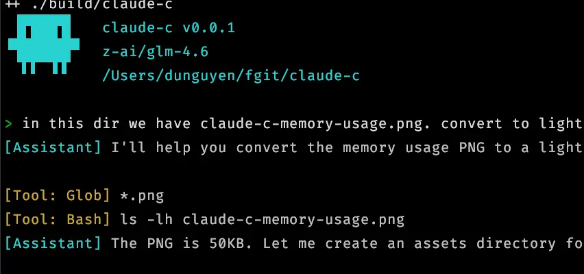
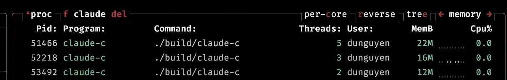

# Claude Code - Pure C Edition

A lightweight, modular implementation of a coding agent that interacts with an Open API compatible API. This is a pure C port of the core functionality from the TypeScript/Node.js Claude Code CLI.



## Installation

### Installing Dependencies

**macOS (Homebrew):**
```bash
brew install curl cjson portaudio
```

**Ubuntu/Debian:**
```bash
sudo apt-get install libcurl4-openssl-dev libcjson-dev portaudio19-dev build-essential
```

## Building

**Recommended: Use stable release**
```bash
git clone --branch v0.1.8 https://github.com/nmnduy/claude-c.git
cd claude-c
make
```

**Building from source (latest development):**
```bash
cd claude-c
make
```

This will produce a `claude-c` executable in the current directory.

**Optional: Install globally**
```bash
make install
```

This installs to `$HOME/.local/bin/claude-c`

## Usage

### Quick start

```sh
export OPENAI_API_KEY=$DEEPSEEK_API_KEY
export OPENAI_API_BASE=https://api.deepseek.com
export OPENAI_MODEL=deepseek-chat
claude-c
```

We dont have config switching yet. But you can also just do this in .bashrc

```bash
alias deepseek-chat="OPENAI_API_KEY=$DEEPSEEK_API_KEY OPENAI_API_BASE=https://api.deepseek.com OPENAI_MODEL=deepseek-chat claude-c"
alias glm-4.6="OPENAI_API_KEY=$ZAI_API_KEY OPENAI_API_BASE=https://api.z.ai/api/paas/v4/chat/completions OPENAI_MODEL=glm-4.6 claude-c"
```

### Color Theme Support

**Available built-in themes:** `kitty-default`, `dracula`, `gruvbox-dark`, `solarized-dark`, `black-metal`

Override via env var `CLAUDE_C_THEME`

## Memory footprint



## Security Notes

- No sandboxing: Bash tool has full shell access
- File tools can access any readable/writable file
- Intended for trusted environments only
